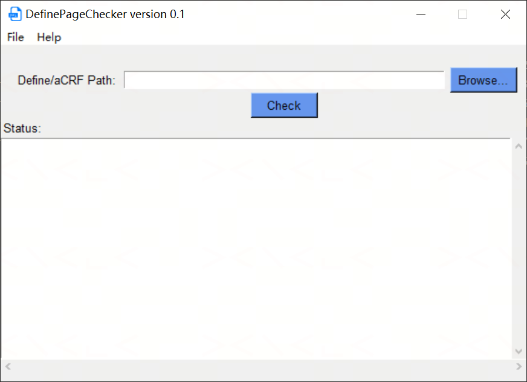

# DefinePageChecker

A Windows desktop tool (GUI + CLI) to verify page number hyperlinks in `define.xml` files against an annotated CRF (aCRF) PDF — built with Python and Tkinter.

---

## Background

The `define.xml` file is a cornerstone of electronic submissions to regulatory agencies (FDA, EMA). It provides metadata about datasets, variables, and clinical trial elements, often including hyperlinks to specific pages in the aCRF. Ensuring the accuracy of these hyperlinks is essential — broken or incorrect links compromise the integrity of the regulatory submission.

DefinePageChecker automates this verification process, replacing time-consuming manual checks with a reliable, reproducible workflow.

---

## Features

- **Hyperlink validation** — parses `define.xml` and validates all page number hyperlinks against the aCRF PDF
- **Out-of-range detection** — detects hyperlinks pointing to the wrong page or a page number beyond the aCRF total
- **Missing annotation flags** — flags aCRF pages with no annotations
- **Color-coded feedback** — real-time output in the GUI (red = errors, orange = notes)
- **GUI and CLI modes** — same binary, same logic
- **Exit codes** — exits with `0` (clean) or `1` (issues found) for easy pipeline integration

---

## Requirements

| Requirement | Notes |
|---|---|
| Windows | Tested on Windows 10/11 |
| Python 3.8+ | |

---

## Installation

```bash
git clone https://github.com/XianhuaZeng/PharmaSUG.git
cd PharmaSUG/2026/DefinePageChecker
pip install -r requirements.txt
```

Key dependencies: `PyPDF2`.

---

## Usage

### GUI mode

Double-click `DefinePageChecker.py`, or run:

```bash
python DefinePageChecker.py
```



**Steps:**
1. Click **Browse…** to select the folder containing `define.xml` and the aCRF PDF
2. Click **Check** to start verification
3. Results appear in the status box in real time:
   - 🔴 Red — hyperlink errors (wrong page or page out of range)
   - 🟠 Orange — pages with no annotations
   - Black — progress and completion messages

---

### CLI mode

```
python DefinePageChecker.py <command> [options]
```

#### Commands

| Command | Description |
|---|---|
| `check` | Verify page number hyperlinks in `define.xml` against an aCRF PDF |

#### Options for `check`

| Option | Description |
|---|---|
| `-d DIR`, `--dir DIR` | Directory containing `define.xml` and the aCRF PDF (auto-detected by filename) |
| `--define FILE` | Path to `define.xml` (use together with `--acrf`) |
| `--acrf FILE` | Path to the annotated CRF PDF (required when `--define` is used) |
| `--version` | Show version and exit |
| `-h`, `--help` | Show help message |

> `-d` and `--define/--acrf` are mutually exclusive — use one approach per run.

#### Examples

```bash
# Auto-detect define.xml and aCRF from a folder
python DefinePageChecker.py check -d C:\submission

# Specify files explicitly
python DefinePageChecker.py check --define C:\sub\define.xml --acrf C:\sub\acrf.pdf

# Show version
python DefinePageChecker.py --version
```

#### Exit codes

| Code | Meaning |
|---|---|
| `0` | No issues found |
| `1` | One or more issues detected |

---

## File detection (auto-detect mode)

When using `-d DIR`, files are located by name pattern:

- **define.xml** — any `.xml` file with `define` in its name (case-insensitive)
- **aCRF PDF** — any `.pdf` file with `acrf` in its name (case-insensitive)

If multiple matches exist, the first match is used. Use `--define` / `--acrf` to specify files explicitly.

---

## Building a standalone executable

```bash
pip install pyinstaller
pyinstaller --onefile --windowed --icon=DefinePageChecker.ico DefinePageChecker.py
```

The compiled `.exe` will be in the `dist/` folder and requires no Python installation on the target machine.

---

## Project structure

```
DefinePageChecker/
├── Testcases/                  # Test input files
├── DefinePageChecker.py        # Main application (GUI + CLI)
├── DefinePageChecker.ico       # Application icon
├── requirements.txt
├── README.md
├── LICENSE
└── docs/
    └── screenshot.png
```

---

## License

MIT License — see [LICENSE](LICENSE) for details.
